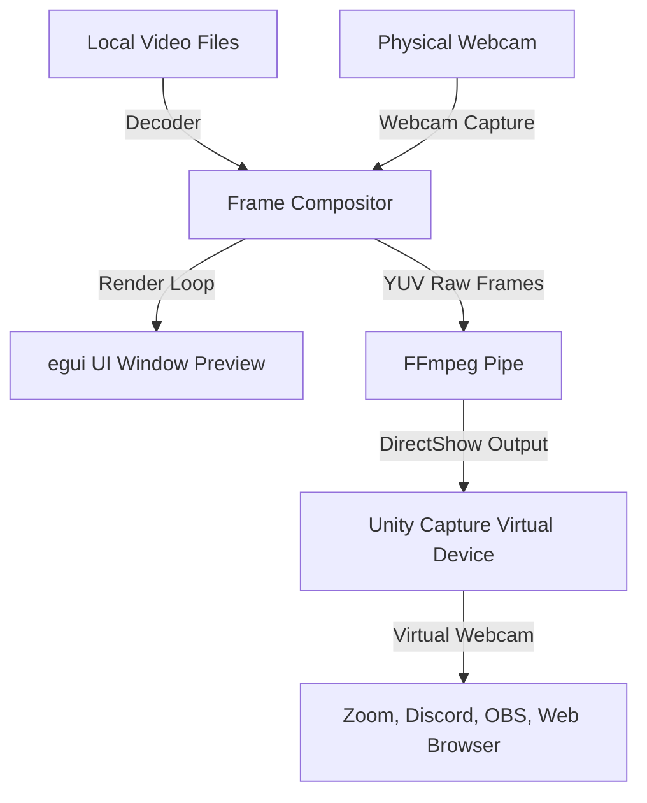

# ⚡ Mimic

**Mimic** is a minimalist, high-performance virtual webcam simulator and video compositor written in Rust. It allows you to play a playlist of video files, composite your real webcam as a custom Picture-in-Picture (PiP) overlay, and stream the resulting feed directly to a virtual webcam device (DirectShow) on Windows.

Built using `eframe` (egui) for the UI and leveraging `ffmpeg` + `UnityCapture` for virtual video device routing, Mimic provides a lightweight, zero-bloat solution for simulating camera inputs.

---

## ✨ Features

- **📂 Video Playlist Player**: Add, loop, and queue local media files (MP4, MKV, AVI, etc.) to feed your virtual webcam.
- **🖼️ Picture-in-Picture (PiP) Overlay**: Embed your physical webcam onto the virtual webcam output with fully customizable parameters:
  - **Positioning**: Bottom Right, Bottom Left, Top Right, Top Left.
  - **Sizing & Scaling**: Adjust the PiP scale interactively.
  - **Aesthetics**: Round the corners of the webcam feed with custom border radius.
- **⚡ Automatic Dependency Management**: 
  - Automatically downloads a lightweight standalone `ffmpeg.exe` build if not present in your PATH.
  - Downloads and registers the `Unity Capture Filter` DirectShow driver (requires administrative approval via UAC prompt upon first setup).
- **⚙️ Configurable Output**: Customize resolution (1080p, 720p, 480p) and frame rate (30 FPS or 60 FPS) to fit your bandwidth/system capability.
- **🎨 Modern Dark UI**: A clean, premium dark-mode interface built on `egui` for ultra-low latency interaction.

---

## 🛠️ Architecture & How It Works

Mimic connects several components under the hood using Rust's safety and concurrency model:



1. **Decoder**: Reads video files frame-by-frame and decodes them.
2. **Webcam Capture**: Captures real-time camera frames from your chosen physical webcam.
3. **Compositor**: Blends the video frame and physical webcam frame together based on your custom PiP settings.
4. **Virtual Driver**: The application pipes the composite video frames into `ffmpeg` which writes directly into the `UnityCapture` virtual device.
5. **DirectShow Virtual Device**: Shows up in Zoom, Teams, Discord, OBS, or web browsers as a standard camera input.

---

## 🚀 Getting Started

### Prerequisites

Currently, Mimic is optimized for **Windows** (due to the DirectShow `UnityCapture` driver integration).

- Windows 10 or 11
- Administrator privileges (for the one-time driver registration process)

### Installation / Running from Release

1. Download the latest compiled binary from the Releases page.
2. Run `mimic.exe`.
3. On the first startup, the app will request to:
   - Download `ffmpeg` (runs in the background).
   - Download the virtual camera driver.
   - Register the DirectShow driver (you will see a standard Windows User Account Control (UAC) prompt requesting administrator rights to register the DLL).
4. Add your video files, choose your webcam overlay (optional), and hit **Start Stream**.

### Building from Source

If you want to build Mimic yourself, you will need the **Rust compiler** installed:

1. Clone the repository:
   ```bash
   git clone https://github.com/yourusername/mimic.git
   cd mimic
   ```
2. Build and run in release mode:
   ```bash
   cargo run --release
   ```

---

## 📄 License

This project is licensed under the **MIT License** - see the [LICENSE](LICENSE) file for details.

---

## 🤝 Contributing

Contributions are welcome! Please feel free to open issues, submit pull requests, or recommend features.
