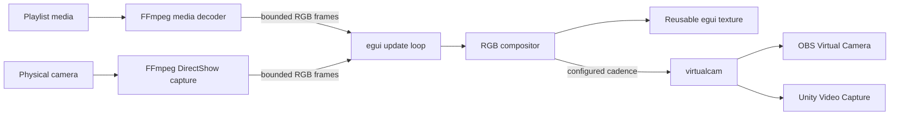

# Runtime architecture

This document records Mimic's current runtime boundaries, ownership, and recovery behavior. It describes the implementation at version `0.1.0`; it is not a future-state design.

## Data flow

FFmpeg processes decode or capture raw RGB24 frames. Mimic composites the optional camera overlay in memory, updates one reusable preview texture when a frame changes, and sends frames through `virtualcam` at the configured output cadence. `virtualcam` owns backend selection and native pixel-format conversion.

## Module responsibilities

| Module | Responsibility | Important boundary |
| --- | --- | --- |
| `config` | Settings schema, normalization, playlist operations, atomic persistence | Invalid indexes/scales and corrupt JSON become safe defaults with visible feedback. |
| `setup` | FFmpeg discovery, virtual-backend detection, verified downloads, Unity registration | Downloads are pinned by URL, byte size, and SHA-256 before activation. |
| `decoder` | Media metadata, FFmpeg child lifecycle, play/pause/seek, bounded frame events | Decode failure and end-of-stream are distinct events; child processes are killed on drop. |
| `webcam` | DirectShow device discovery and FFmpeg capture lifecycle | Capture errors surface to the UI; only a bounded number of frames can queue. |
| `compositor` | Frame normalization, rounded PiP composition, virtual-camera lifecycle | Malformed frame lengths are normalized; send errors are returned to the UI. |
| `gui` | Product state, user feedback, repaint cadence, preview, transport, setup controls | Output format is locked while live and output cannot start without media and a backend. |
| `diagnostics` | Bounded JSONL product-event logging and rotation | Stores sanitized event metadata, never decoded/captured frames. |
| `doctor` | Scriptable environment, media, camera, receiver, and soak proofs | Every probe has bounded work, cleanup, typed reports, and stable result semantics. |
| `lib` | Shared application surface for GUI and diagnostic binaries | Keeps the CLI testable without coupling it to console-host behavior. |
| `main` | Native window configuration and GUI startup | Establishes application identity and the minimum supported layout size. |
| `build.rs` | Windows icon and version-resource generation | Derives all ICO sizes from the tracked SVG source during the build. |

## State and lifecycle

Mimic keeps three long-lived resources in the UI owner:

1. A media decoder for the selected playlist item.
2. An optional physical-camera capture.
3. A compositor that may own an active virtual-camera device.

Replacing a media item drops the prior decoder and its FFmpeg child. Disabling or changing the PiP camera drops the previous capture. Stopping output calls `release` on the virtual camera. Drop implementations are also defensive, so closing the app does not intentionally leave child FFmpeg processes or the virtual camera active.

Decoder and webcam workers use bounded frame channels. If the UI is temporarily slower than a producer, additional intermediate frames are discarded instead of allowing memory growth; terminal error/end events remain deliverable. The UI requests its next repaint from the configured output interval instead of continuously busy-repainting.

## Persistence

`AppConfig` is stored at `%APPDATA%\mimic\config.json`. Loading applies schema defaults and normalization, including valid output indexes, bounded PiP values, deduplicated paths, and a valid current playlist index. Saving writes and flushes `config.json.tmp`, then atomically replaces the destination with the Windows `MoveFileExW` replace flag.

Settings store file paths and device names only. Video frames are not written by Mimic.

Product events are appended to `%APPDATA%\mimic\logs\mimic.jsonl`. The active log is
limited to 512 KiB and rotated through three backups. Event titles and sanitized detail
are retained for local support; there is no network telemetry.

## Setup integrity

Mimic first looks for a working `ffmpeg` in `PATH`, then its managed AppData copy, then an executable beside Mimic. Discovery executes `ffmpeg -version`; path existence alone is not readiness.

Managed downloads use a `.download` partial file. Mimic checks the upstream reported length when present, streamed byte count, expected size, and SHA-256, flushes the file, then atomically activates it. Failed or mismatched downloads are removed. The exact upstream decision and hashes are recorded in [the research note](research/2026-07-15-runtime-stack-recovery.md).

Unity registration uses an elevated `regsvr32` request. Starting elevation is not considered success: Mimic polls the supported Unity backend registration and reports a failure if the device does not become available.

## Verification architecture

`mimic-doctor` deliberately tests both sides of a virtual-camera boundary. It sends a
deterministic RGB pattern, warms the backend, then starts an independent FFmpeg
DirectShow receiver and requires the requested frame count plus aggregate hashes. Sender
acceptance alone is not a pass. Media, camera, and soak probes follow the same bounded
frame/event channels as the GUI and terminate owned child processes on every exit path.

The diagnostic JSON schema is versioned (`schema_version: 1`). Human output and JSON
share typed reports, while process exit codes distinguish invalid input, unavailable
prerequisites, and failed/timed-out proofs.

## Failure and recovery matrix

| Condition | User-visible behavior | Recovery |
| --- | --- | --- |
| FFmpeg missing | Setup banner and disabled media decoding | Install from the verified setup action or provide FFmpeg in `PATH`. |
| No supported virtual camera | Start remains disabled with a specific blocker | Install OBS Virtual Camera or approve UnityCapture setup, then refresh/restart. |
| Missing playlist file | Item is marked unavailable and decode is not started | Reconnect its storage, remove it, or add a replacement. |
| Unsupported or duplicate import | Import summary reports skipped files | Add a supported, unique path. |
| Media metadata/decode failure | Error notice contains the FFmpeg-facing reason | Select another file or repair the source media. |
| Webcam discovery/capture failure | PiP notice reports the failed operation | Refresh devices, choose another device, or disable PiP. |
| Virtual-camera send failure | Output stops and the error is surfaced | Release the camera in other apps, confirm the backend, then restart output. |
| Corrupt settings | Safe defaults load with a warning | Reconfigure; the next successful user change writes valid settings. |

## Non-goals and current limits

- No audio capture or routing.
- No cross-platform backend abstraction beyond the Windows `virtualcam` implementation.
- No persistence of decoded or captured frames.
- No promise that every FFmpeg-supported codec is accepted by a receiving application.
- The repository produces an unsigned portable ZIP; certificate-backed signing and a
  clean-machine installer/driver-uninstall lifecycle remain external gates.
